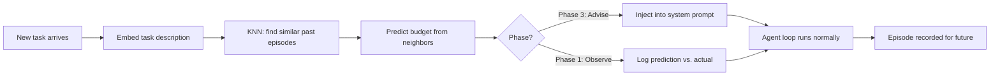

# Loop Pilot

**An experiment in teaching agent harnesses to learn from their own behavior.**

> Hypothesis: If an agent harness records how past tasks succeeded — which tools, how many calls, what sequences — it can predict optimal behavior for future tasks and guide the model before the loop starts.

We're testing this. You can too.

---

## The Question

Every agent harness has a loop: call the model → model requests a tool → execute tool → repeat. When should it stop?

Today's options are bad:

1. **No limit** — trust the model to self-regulate. It doesn't. RLHF trained it to be thorough, not efficient. Context windows explode.
2. **Hard cap** — cut off after N iterations regardless of task complexity. A calendar lookup and a research synthesis get the same budget.

Both fail because the model is **uninformed.** It doesn't know what similar tasks looked like before. It has no fuel gauge.

**Our hypothesis:** Past behavior — recorded, embedded, and retrieved via similarity search — can predict what a successful run looks like for a given task. If the model sees that prediction as context, it self-regulates better than either blind trust or rigid caps.

**We don't know if this is true yet.** That's what the experiment is for.

---

## The Experiment

Loop Pilot runs in three phases. Each phase has clear entry criteria — you don't advance until the data justifies it.

### Phase 1: Observe 👁️ ← *we are here*

**Goal:** Collect labeled ground truth. Measure whether predictions *would have* been useful.

The observer watches your agent harness run normally. For every task, it:

1. Records the task description
2. Makes a prediction (suggested budget, tools, confidence) — **but does NOT inject it**
3. Records what actually happened (actual tool calls, actual tools, actual outcome)
4. Labels the outcome (success/failure, efficient/wasteful)

**What you get:** A growing dataset of `(prediction, actual, outcome)` triples. After enough episodes, you can measure: *would the model have done better if it had seen this prediction?*

**Entry criteria:** Install Loop Pilot. Point it at your harness logs. Let it run.

**Exit criteria:** Prediction accuracy consistently correlates with task success across N episodes (N TBD — we're figuring this out together).

```bash
npm install looppilot

# Discover your harness's logs
looppilot collection scan /path/to/your-harness --json

# Initialize and import
looppilot collection init /path/to/your-harness
looppilot collection parse --config ./looppilot.collections.json
looppilot collection import --config ./looppilot.collections.json

# Build embeddings
looppilot index \
  --embedding http \
  --embedding-url http://127.0.0.1:8000/embed \
  --dimensions 768

# Run observer (shadow mode — predicts but doesn't inject)
looppilot observe \
  --events /path/to/your-harness/data/events.jsonl \
  --output data/shadow-observations.jsonl

# Cal Strands: include active session inventory when available
looppilot observe \
  --events /path/to/cal-gateway/data/events.jsonl \
  --output data/shadow-observations.jsonl \
  --cal-sessions-url http://127.0.0.1:8080/api/observer/sessions
```

### Phase 2: Validate 📊

**Goal:** Determine whether behavior memory actually predicts success. Choose the right algorithm.

With enough labeled episodes, ask:

- Does KNN similarity on task embeddings predict tool budgets that correlate with good outcomes?
- Would a lightweight neural net outperform KNN?
- What's the minimum corpus size for useful predictions?
- Does `tool_chain` sequence matching (suggested by [@kehansama](https://github.com/anthropics/claude-code/issues/65712#issuecomment-2934938693)) improve prediction over task-description similarity alone?

**Entry criteria:** Phase 1 has collected enough labeled episodes to run statistically meaningful validation.

**Exit criteria:** A prediction method demonstrably outperforms the baseline (fixed budget) on your harness's data.

```bash
# Leave-one-out cross-validation against your episode history
looppilot benchmark \
  --embedding http \
  --embedding-url http://127.0.0.1:8000/embed \
  --dimensions 768
```

### Phase 3: Advise 🎯

**Goal:** Connect validated predictions to the model's system prompt. Measure real-world impact.

Only when Phase 2 shows predictions are accurate, inject guidance into the agent loop:

```
## Loop Pilot Guidance

Similar past behavior suggests:
- Suggested tool-call budget: 4
- Confidence: high
- Risk: low
- Likely useful tools: bash, web_search, write_file

Reason: Based on 5 similar successful episode(s), average tool calls were 3.2.
Repeated-tool caution: similar tasks repeated bash. Avoid repeating
a tool once enough context is found.

Use this as operational guidance. Continue to reason normally.
```

**Philosophy: inform, then trust.** The model receives guidance as context, not as a command. The harness's hard safety cap remains unchanged as a backstop. Loop Pilot never overrides. Never halts. Just surfaces the signal the model can't see on its own.

**Entry criteria:** Phase 2 validation shows predictions outperform baseline.

**Exit criteria:** A/B comparison shows the model produces better outcomes with guidance than without.

---

## Architecture



**Key design decisions:**

- **Advisory only.** Loop Pilot never changes hard limits. It informs. The model decides.
- **Fail-open.** If Loop Pilot is down, the harness continues without guidance. Never a blocker.
- **No embedded model.** Loop Pilot uses your harness's existing embedding model. One model, two uses.
- **Local-first.** SQLite-backed. Runs beside your harness. Your data never leaves your machine.

---

## Library Usage

```typescript
import { LoopPilot, SqliteEpisodeStore, HttpEmbeddingProvider } from "looppilot";

const pilot = new LoopPilot({
  store: new SqliteEpisodeStore({ dbPath: "looppilot.sqlite" }),
  embeddings: new HttpEmbeddingProvider({
    endpoint: "http://127.0.0.1:8000/embed",
    dimensions: 768,
  }),
});

// Phase 1: Get prediction (observe only — don't inject)
const plan = await pilot.plan({ task: "Summarize my unread emails" });
console.log(plan.prediction.suggestedBudget); // 4
console.log(plan.prediction.confidence);       // "medium"

// After task completes, record what actually happened
await pilot.recordEpisode({
  task: "Summarize my unread emails",
  toolCalls: ["read_mail", "read_mail", "genai_chat"],
  totalCalls: 3,
  outcome: "success",
  label: "efficient",
});
```

## MCP Tools

When running as an MCP server, Loop Pilot exposes four tools:

| Tool | Purpose |
|------|---------|
| `plan_task` | Get budget prediction for a task (observe or advise mode) |
| `record_episode` | Record a completed episode with outcome label |
| `import_episodes` | Bulk import historical episodes |
| `get_stats` | Memory statistics (episode count, coverage, accuracy) |

## Embedding Provider

Loop Pilot does **not** ship an embedding model. Your harness provides embeddings via:

| Provider | How It Works |
|----------|--------------|
| `http` | POSTs text to a local endpoint, expects `number[]` or `{ embedding: number[] }` |
| `command` | Pipes text to a CLI command, reads `number[]` from stdout |
| `deterministic` | Fast hash-based embedder for tests only |

**Recommended:** Share your harness's existing embedding model. If your harness already runs a local model for RAG or knowledge search, point Loop Pilot at the same endpoint. One model, two uses, no extra memory.

---

## Reference Implementation: Cal

[Cal](https://github.com/monbishnoi/cal) is an open-source agent harness — a personal system for memory, tools, and multi-channel access. Loop Pilot is running as Cal's trajectory observer (Phase 1).

**Current dataset (as of June 5, 2026):**

| Metric | Value |
|--------|-------|
| Episodes recorded | 404 |
| Average tool calls per task | 3.0 |
| Range | 0 – 40 tool calls |
| Historical success rate | 88% |
| Tasks that hit max iterations | 7.7% |

We're collecting labeled data now. When prediction accuracy justifies it, we'll advance to Phase 3.

---

## Why Not Just Post-Train the Model?

Agentic RL post-training (Tool-R1, ARTIST, DAPO) can teach models generic tool-call efficiency. But post-training is excruciatingly expensive — feasible only for foundation model labs training general-purpose models. You cannot post-train a frontier model on every custom harness, every private toolset, every user's workflow.

| Model Generation | Generic tasks | Your custom harness |
|-----------------|---------------|---------------------|
| Current | Loop Pilot informs heavily | Loop Pilot informs heavily |
| Post-trained | Model handles natively | **Still valuable** — wasn't trained on your tools |
| Far future | Model handles natively | **Still valuable** — your user's patterns are a long tail |

Loop Pilot isn't a temporary crutch. It's infrastructure for the permanent gap between general model intelligence and your specific system's behavioral patterns.

---

## Open Questions (Help Wanted)

These are the questions we're actively investigating. If you have ideas, data, or implementations — open an issue or PR.

1. **What corpus size is the minimum for useful predictions?** Is 100 episodes enough? 500? Does it depend on task diversity?

2. **Does tool-chain sequence matching outperform task-description similarity?** [@kehansama suggested](https://github.com/anthropics/claude-code/issues/65712#issuecomment-2934938693) adding a `tool_chain` field to match on *process similarity*, not just task description. Two tasks might have similar descriptions but very different optimal tool chains — and vice versa.

3. **KNN vs. neural net vs. something else?** KNN is the Phase 1 baseline. Is there a better algorithm for this prediction task once we have enough data?

4. **Cross-platform behavioral patterns.** Developers use Claude Code, Codex, and Cursor on the same project. Can behavioral patterns learned on one harness transfer to another? (See AgentRelay's [cross-platform relay concept](https://github.com/anthropics/claude-code/issues/65712#issuecomment-2934938693).)

5. **What does "success" mean?** Our current labels are simple (success/failure, efficient/wasteful). What richer outcome signals would improve predictions?

6. **Mid-loop steering:** Can Loop Pilot detect drift *during* a run and nudge the model in real-time? What's the right trigger for intervention vs. silence?

---

## Contributing

This is an experiment, not a finished product. We want three kinds of contributions:

### 🧪 Run the experiment
Install Loop Pilot on your custom harness. Run Phase 1. Share what you find — even (especially) if predictions are bad. Every harness teaches us something.

### 💡 Propose ideas
Architectural suggestions, algorithm improvements, new signals to capture. [kehansama's tool_chain suggestion](https://github.com/anthropics/claude-code/issues/65712#issuecomment-2934938693) is a perfect example — a concrete idea that challenges our assumptions about what similarity means.

### 🔧 Build adapters
Loop Pilot needs adapters for different harness log formats. Currently supports JSONL events (Cal-style). Adapters wanted for:
- LangChain / LangGraph traces
- CrewAI execution logs
- AutoGen conversation logs
- Cursor / Windsurf session data
- Your custom format

See [CONTRIBUTING.md](./CONTRIBUTING.md) for details.

---

## Ecosystem

Loop Pilot has been proposed as a contribution to both major agent harness projects:

- **OpenAI Codex:** [RFC: Behavior-memory budget prediction](https://github.com/openai/codex/issues/26665)
- **Anthropic Claude Code:** [Proposal: Behavior-memory budget advisor as pre-loop hook](https://github.com/anthropics/claude-code/issues/65712)

---

## Requirements

- Node.js 22+
- An embedding provider (local HTTP endpoint, CLI command, or shared model)
- Past harness behavior logs (JSONL events, structured episodes, or custom adapter)

## License

MIT — Monika Bishnoi, 2026
