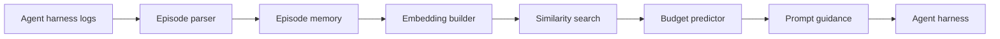

# Loop Pilot

Loop Pilot is a trajectory optimization engine for custom agent harnesses. It learns from past runs, predicts tool budgets, and injects guidance so loops do not drift, waste calls, or exhaust early.

> Mission control for agent trajectories.

Phase 1 turns agent runtime logs into behavior episodes, embeds those episodes, finds similar past tasks with KNN, and returns a budget plus prompt guidance before the next agent loop starts.

## Simple Architecture



Built in Phase 1:

- Episode parser
- Episode memory
- Embedding builder
- Similarity search
- Budget predictor
- Prompt guidance block
- CLI
- HTTP/MCP wrapper
- JSONL event adapter

Planned next:

- More harness adapters
- Scheduled import/index jobs
- Better benchmark reporting
- Tool-failure learning
- Optional hosted/service packaging
- Later: runtime steering and bandit learning

Loop Pilot is currently a **local-first package and MCP/HTTP server**, not a hosted API service. You run it beside your harness and connect it to your own embedding provider.

## Requirements

To use Loop Pilot, you need:

- Node.js 22 or newer
- A place to store local SQLite memory
- Past harness behavior, either logs or structured episodes
- An embedding provider

Embedding provider options:

- HTTP endpoint, for example `http://127.0.0.1:8000/embed`
- Local command that reads text on stdin and returns an embedding
- The deterministic test embedder, only for tests

Recommended local model style:

- A small embedding model that can run locally, or a shared embedding service your harness already uses

## Commands

```bash
looppilot collection scan /path/to/harness --json
looppilot collection init /path/to/harness
looppilot collection parse --config /path/to/harness/looppilot.collections.json
looppilot collection import --config /path/to/harness/looppilot.collections.json
looppilot import events --events /path/to/events.jsonl --errors /path/to/error.log --harness my-harness
looppilot index --embedding http --embedding-url http://127.0.0.1:8000/embed --dimensions 768
looppilot plan --task "Prepare me for my next meeting" --embedding http --embedding-url http://127.0.0.1:8000/embed --dimensions 768
looppilot benchmark --events /path/to/events.jsonl --errors /path/to/error.log --embedding command --embedding-command /path/to/embed-one --dimensions 768
looppilot serve --transport http --port 8191
looppilot serve --transport mcp --port 8191
```

The recommended onboarding path is automatic:

1. `collection scan` searches a harness repo for likely behavior logs and prints agent-readable JSON when `--json` is used.
2. `collection init` writes `looppilot.collections.json` from the detected logs.
3. `collection parse` dry-runs the parser and shows a small episode sample.
4. `collection import` imports those episodes into Loop Pilot memory.

The lower-level `import events --events ...` command is still available when you already know the exact log paths.

## MCP Tools

When Loop Pilot runs with `looppilot serve --transport mcp`, it exposes four generic tools:

| Tool | Purpose |
|---|---|
| `plan_task` | Return budget guidance, likely tools, risk, and a prompt guidance block before a task starts. |
| `record_episode` | Record one completed behavior episode from a harness that can emit structured run data. |
| `import_episodes` | Bulk import parsed historical episodes, useful for first setup and scheduled refresh jobs. |
| `get_stats` | Return basic memory statistics such as stored episode count. |

Harnesses usually call `plan_task` before a run begins. The ingestion tools are available for first setup, scheduled refreshes, and harnesses that can report completed episodes directly.

Loop Pilot does not install or own an embedding model. It uses a configured embedding provider:

- `http`: POSTs task text to a shared local embedding service and expects `number[]` or `{ "embedding": number[] }`.
- `command`: sends task text to a local command on stdin and expects `number[]` or `{ "embedding": number[] }`.
- `deterministic`: a fast test provider only.

Small local embedding models are a good default, but they should run as a shared provider outside Loop Pilot. That lets an existing harness reuse the same model for behavior embeddings without downloading or compiling a second copy.

If no embedding provider is configured, indexing and planning will fail with a setup error instead of silently using the test embedder.

## Library

```ts
import { HttpEmbeddingProvider, LoopPilot, SqliteEpisodeStore } from "looppilot";

const loopPilot = new LoopPilot({
  store: new SqliteEpisodeStore({ dbPath: "looppilot.sqlite" }),
  embeddings: new HttpEmbeddingProvider({
    endpoint: "http://127.0.0.1:8000/embed",
    dimensions: 768
  })
});

const plan = await loopPilot.plan({ task: "Prepare me for my next meeting" });
```
