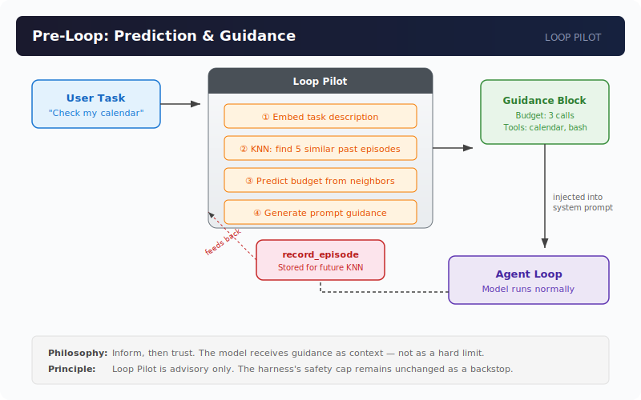
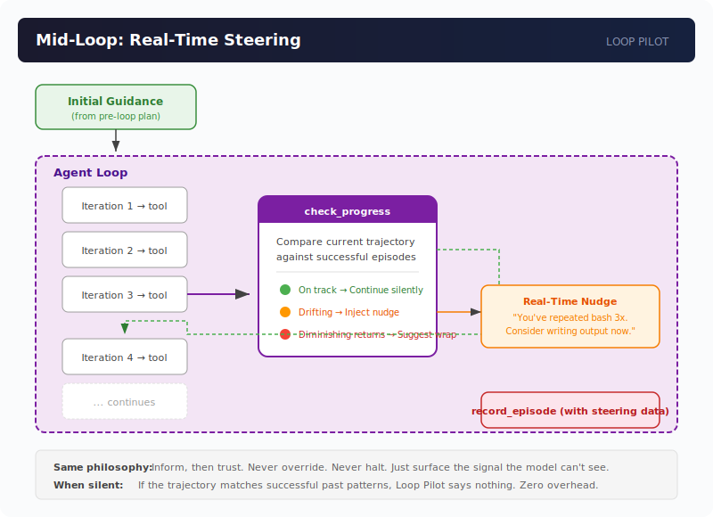

# Loop Pilot

**A trajectory optimization engine for custom agent harnesses.**

Learns from past runs, predicts tool budgets, and injects guidance — so loops don't drift, waste calls, or exhaust early.

> Mission control for agent trajectories.

---

## The Problem

Every agent harness has a loop: call the model → model requests a tool → execute tool → repeat. The question is: when should the loop stop?

**Most harnesses pick one of two bad options:**

1. **No limit** — trust the model to self-regulate. It doesn't. It researches forever because RLHF trained it to be thorough, not efficient. The context window explodes.

2. **Hard cap** — cut the model off after N iterations regardless of task complexity. A simple lookup and a complex write task get the same budget. The model doesn't know it's about to be cut off, so it can't prioritize.

Both fail because the model is **uninformed**. It doesn't know its budget. It doesn't know what similar tasks looked like before. It has no fuel gauge.

## The Solution

Loop Pilot gives your harness a behavior memory. Before each agent loop starts, it:

1. **Finds similar past episodes** using KNN similarity search
2. **Predicts a tool budget** based on what worked before
3. **Generates a guidance block** that gets injected into the system prompt

The model reads the guidance and self-regulates. No hard cap changes. No dynamic halting. Just: here's your fuel gauge, here's your map, you're the driver.

**Philosophy: inform, then trust.**

## How It Works


The guidance block looks like this:

```
## Loop Pilot Guidance

Similar past behavior suggests:
- Suggested tool-call budget: 4
- Confidence: high
- Risk: low
- Likely useful tools: bash, web_search, write_file

Reason: Based on 5 similar successful episode(s), average tool calls were 3.2.
Likely allocation:
- bash: 2 calls
- web_search: 1 call
- write_file: 1 call
Repeated-tool caution: similar tasks repeated bash. Avoid repeating
a tool once enough context is found.

Use this as operational guidance. Continue to reason normally.
```

The model treats this as context, not as a command. It self-moderates — the same way a researcher adjusts when told "the deadline is tomorrow."

## Quick Start

```bash
npm install looppilot
```

### 1. Import your harness logs

```bash
# Auto-detect log files in your harness repo
looppilot collection scan /path/to/your-harness --json

# Initialize collection config
looppilot collection init /path/to/your-harness

# Parse and import episodes
looppilot collection parse --config /path/to/looppilot.collections.json
looppilot collection import --config /path/to/looppilot.collections.json
```

### 2. Build embeddings

```bash
looppilot index \
  --embedding http \
  --embedding-url http://127.0.0.1:8000/embed \
  --dimensions 768
```

### 3. Get guidance for a task

```bash
looppilot plan \
  --task "Summarize my unread emails" \
  --embedding http \
  --embedding-url http://127.0.0.1:8000/embed \
  --dimensions 768
```

### 4. Run as a server

```bash
# HTTP server
looppilot serve --transport http --port 8191

# MCP server (for Claude Code, Cal, or any MCP-compatible harness)
looppilot serve --transport mcp --port 8191
```

## Library Usage

```typescript
import { LoopPilot, SqliteEpisodeStore, HttpEmbeddingProvider } from "looppilot";

const pilot = new LoopPilot({
  store: new SqliteEpisodeStore({ dbPath: "looppilot.sqlite" }),
  embeddings: new HttpEmbeddingProvider({
    endpoint: "http://127.0.0.1:8000/embed",
    dimensions: 768,
  }),
});

// Get guidance before your agent loop starts
const plan = await pilot.plan({ task: "Prepare me for my next meeting" });

console.log(plan.prediction.suggestedBudget); // 4
console.log(plan.promptGuidance); // Full guidance block to inject
```

## MCP Tools

When running as an MCP server, Loop Pilot exposes four tools:

| Tool | Purpose |
|------|---------|
| `plan_task` | Get budget prediction + prompt guidance before a task starts |
| `record_episode` | Record a completed episode from a harness that reports structured run data |
| `import_episodes` | Bulk import historical episodes (first setup / scheduled refresh) |
| `get_stats` | Memory statistics (episode count, coverage) |

## Embedding Provider

Loop Pilot does **not** ship an embedding model. Your harness provides embeddings via one of:

| Provider | How It Works |
|----------|--------------|
| `http` | POSTs text to a local endpoint, expects `number[]` or `{ embedding: number[] }` |
| `command` | Pipes text to a CLI command, reads `number[]` from stdout |
| `deterministic` | Fast hash-based embedder for tests only |

**Recommended:** Share your harness's existing embedding model. If your harness already runs a local model for RAG or knowledge search, point Loop Pilot at the same endpoint. One model, two uses, no extra memory.

## Architecture

Loop Pilot operates in two modes:

### Pre-Loop: Prediction & Guidance



Before the agent loop starts, Loop Pilot embeds the task, finds similar past episodes via KNN, predicts a tool budget, and injects guidance into the system prompt. The model self-regulates. When the loop completes, the episode feeds back into memory for future predictions.

### Mid-Loop: Real-Time Steering



During the agent loop, Loop Pilot monitors the trajectory as it unfolds — comparing the current sequence of tool calls against successful past episodes. If the agent is drifting (repeating tools, diverging from patterns that worked), it injects a real-time nudge. If it's on track, it stays silent. If it's hitting diminishing returns, it suggests wrapping up.

The philosophy stays the same in both modes: inform, then trust. Never override. Never halt. Just surface the signal the model can't see on its own.

## Benchmarking

Run leave-one-out cross-validation against your own episode history:

```bash
looppilot benchmark \
  --events /path/to/events.jsonl \
  --errors /path/to/error.log \
  --embedding command \
  --embedding-command ./embed-one \
  --dimensions 768
```

Reports: success rate vs. fixed budget, under/over-budget rate, max-iteration avoidance rate.

## Roadmap

- [x] Episode memory + KNN similarity
- [x] Budget prediction + prompt guidance
- [x] CLI + HTTP/MCP server
- [x] JSONL event adapter
- [x] Leave-one-out benchmark
- [ ] More harness adapters (LangChain, CrewAI, custom)
- [ ] Tool-failure learning (weight errors higher)
- [ ] Runtime steering (mid-loop adjustment)
- [ ] Bandit learning (explore vs. exploit on budget)
- [ ] npm publish

## Requirements

- Node.js 22+
- An embedding provider (local HTTP endpoint, CLI command, or shared model)
- Past harness behavior logs (JSONL events, structured episodes, or custom adapter)

## Philosophy

Loop Pilot implements **"inform, then trust"** — a middle path between blind trust (no limits, hope the model stops) and rigid constraint (hard caps, defense in depth).

The model receives its budget as context, not as a hard limit. It self-regulates. The harness's existing safety cap remains unchanged as a backstop.

### Why not just post-train the model?

Agentic RL post-training (Tool-R1, ARTIST, DAPO) can teach models to internalize tool-call efficiency — but it's excruciatingly expensive and only feasible for foundation model labs training general-purpose models. You can't post-train a frontier model on every custom harness, every private toolset, every unique workflow. The economics don't work.

Loop Pilot gives any custom harness the *behavioral* benefits of post-training — learned iteration patterns, diminishing-returns awareness, tool-specific budgeting — without touching model weights. It runs at the harness layer, learns from *your* logs, and works with any model.

As general-purpose models get post-trained on agentic efficiency, they'll internalize *generic* tool-use discipline — when to stop searching, when to write instead of research. Loop Pilot's general budget guidance simplifies for those cases.

But here's the thing: post-training can't cover the long tail. Your custom harness has unique tools, unique workflow shapes, unique patterns of what "success" looks like. No foundation model will ever be trained on *your* specific system. For harness-specific behavioral memory, Loop Pilot remains valuable — indefinitely.

| Model Generation | Generic tasks | Your custom harness |
|-----------------|---------------|---------------------|
| Current (no agentic RL) | Loop Pilot informs heavily | Loop Pilot informs heavily |
| Post-trained (general efficiency) | Model handles this natively | **Loop Pilot still valuable** — model wasn't trained on your tools |
| Far future | Model handles this natively | **Loop Pilot still valuable** — custom workflows are a long tail post-training will never reach |

That's the real positioning: Loop Pilot isn't a temporary crutch. It's infrastructure for the space between general model intelligence and your specific system's patterns.

## License

MIT — Monika Bishnoi, 2026

## Contributing to the Ecosystem

Loop Pilot has been proposed as a contribution to both major agent harness projects:

- **OpenAI Codex:** [RFC: Behavior-memory budget prediction for agent loops](https://github.com/openai/codex/issues/26665)
- **Anthropic Claude Code:** [Proposal: Behavior-memory budget advisor as pre-loop hook](https://github.com/anthropics/claude-code/issues/65712)

If you're building a custom harness and want to integrate Loop Pilot, see [CONTRIBUTING.md](./CONTRIBUTING.md) or open an issue.
